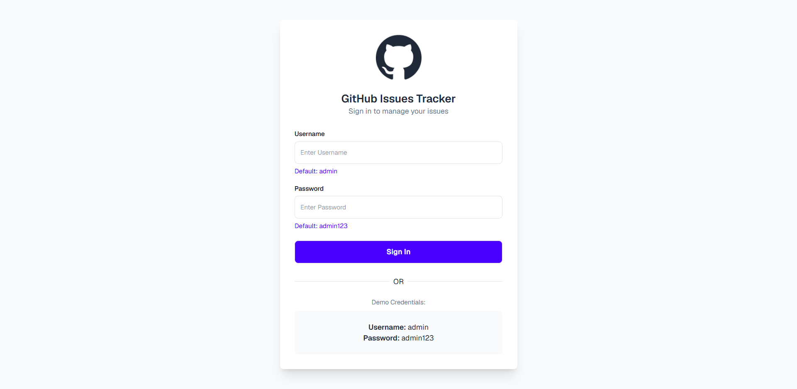
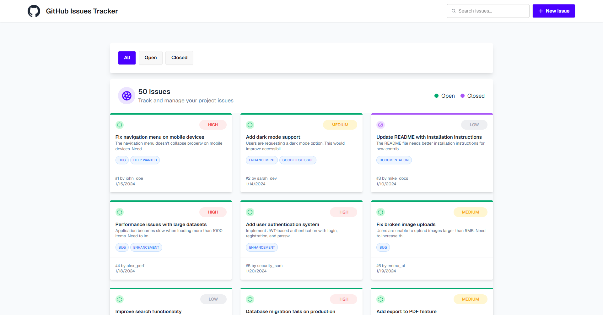
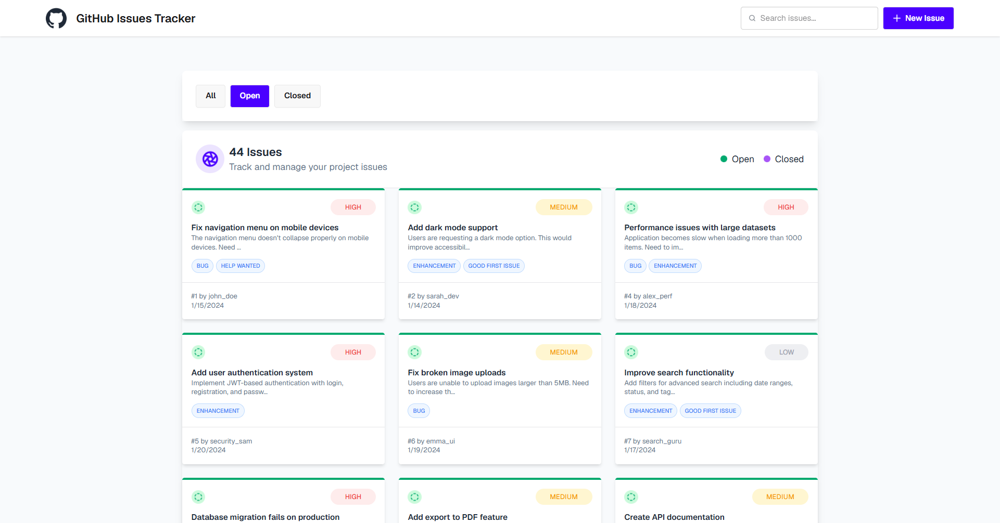
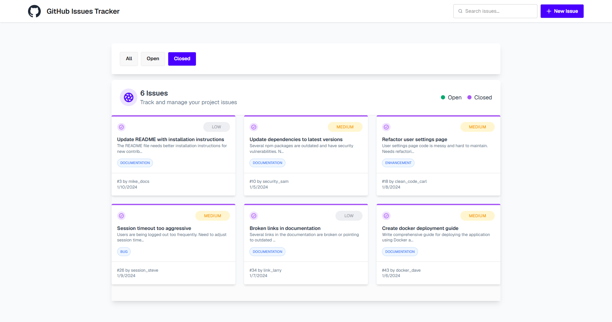

# GitHub Issues Tracker

A simple GitHub-style Issues Tracker project that I built while learning JavaScript and frontend development.

The project includes a sign-in interface and focuses on practicing JavaScript fundamentals along with building an interactive issue-tracking UI.

---

## Project Features

* GitHub-style issue tracker interface
* Sign-in interface with demo credentials
* Issue filtering and searching
* Issue status management
* Issue details view
* Dynamic UI updates
* Priority-based styling

## Technologies Used

* HTML5
* JavaScript (ES6+)
* Tailwind CSS
* DaisyUI
* Font Awesome
* Google Fonts

## What I Practiced

* JavaScript ES6 features
* Array methods
* DOM manipulation
* Event handling
* Dynamic rendering
* Working with API-based data
* Building an interactive frontend interface

## Demo Credentials

```text
Username: admin
Password: admin123
```

## Live Demo

[View Live Website](https://github-issues-tracker-site.netlify.app)

## Screenshots






### GitHub: [FahmidaAkterShimu](https://github.com/FahmidaAkterShimu)
